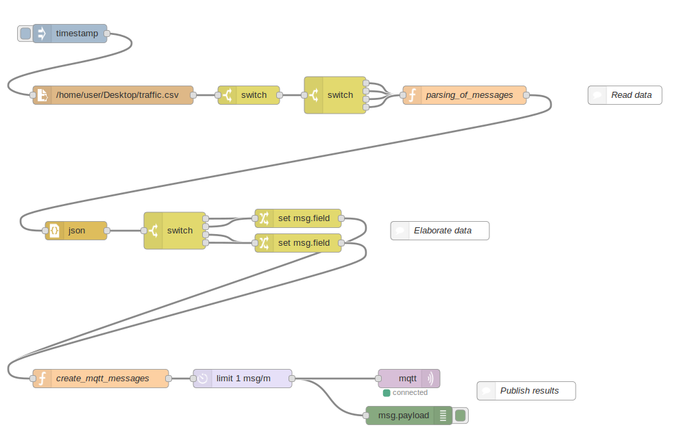

# Homework #2
The goal of this homework is to replicate real MQTT messages and send them to a thingspeak channel.

## Assignment
Read the [traffic.csv](./traffic.csv) file, and keep only publish messages coming from the following topics:

+ factory/department1/section1/plc
+ factory/department3/section3/plc
+ factory/department1/section1/hydraulic_valve
+ factory/department3/section3/hydraulic_valve

Send the «value» field of the original message as MQTT messages to the thingspeak channel in order to fill charts and activate indicators.

## ThingSpeak
Thingspeak channel receives data and visualize them using:

+ 2 charts for field1 and field2
+ 2 lamps indicator (turn it ON w/ data >= 2000) for field1 and field2

channel ID: [1359553](https://thingspeak.com/channels/1359553)

## Result
The final schema is the following: 

The result is discussed in the [report](./report.pdf) file
