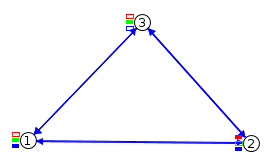

# Homework #3
The goal of this homework is to use Cooja to simulate the interaction of three mote on which an application for TinyOS has been installed.

  

## Assignment
+ Create a Cooja simulation with three TinyOS (sky) motes, called 1, 2 and 3.
+ The three motes communicate over the radio. The message is composed by a counter and the sender id. All the messages are sent in BROADCAST.
+ Messages are sent at:
  +  1 Hz for mote 1
  +  3 Hz for mote 2
  +  5 Hz for mote 3
+ Turn on/off the LEDs according the following rules:
  + Messages sent by mote 1 toggle led0
  + Messages sent by mote 2 toggle led1
  + Messages sent by mote 3 toggle led2
  + Messages received with ’counter mod 10’ == 0 turn off all the LEDs
+ The counter is incremented after a new message is received.

## Result
The result is discussed in the [report](./report.pdf) file
